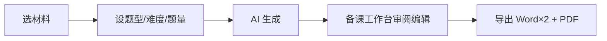

# 初中英语教师备课助手 — 产品设计规格

**日期：** 2026-05-20  
**状态：** 已头脑风暴确认，待实现计划  
**基础仓库：** AI 英语出题助手（Next.js MVP）  
**改造策略：** 在现有项目上演进（方案二：教师主路径 + 保留自学副路径）

---

## 1. 背景与目标

### 1.1 问题

初中英语教师备课耗时，尤其从阅读/完形材料手工出题、排版、做答案册。

### 1.2 产品定位

**「初中英语教师备课助手」** — 教师可在约 10 分钟内，从一篇阅读材料得到**可打印、可在 Word 中继续编辑**的阅读理解或完形填空卷面（学生版 + 教师版 + PDF）。

### 1.3 目标用户

- **主要：** 初中英语教师  
- **次要（保留）：** 家长与自学用户 — 通过「在线预览/自练」副路径，不抢主叙事

### 1.4 核心目标（用户确认）

| 维度 | 选择 |
|------|------|
| 首要任务 | **A** 省备课时间：材料 → 可直接使用的练习 |
| 学段 | **A** 初中英语 |
| 发放方式 | **B** 导出打印（非主流程在线答题） |
| MVP 题型 | **A+B** 阅读理解 + 完形填空 |
| 审阅方式 | **D** 网页审阅编辑 + 导出 Word 后继续改 |
| 导出物 | **C** 学生版 Word + 教师版 Word + PDF |
| 材料来源 MVP | **B+C** 上传 PDF/DOCX + Reading Hub |
| 教材单元 | **第二期**（MVP 不做） |
| 代码关系 | **A** 改造现有仓库 |
| 原文依据 | **C** 导出教师版时可选「含原文依据」 |

### 1.5 成功标准（MVP）

1. 从选文到拿到学生版 Word ≤ 15 分钟（含 AI 等待与审阅）  
2. 学生版可直接打印；教师版含答案与中文解析  
3. 试点（5–10 名教师）：≥ 80% 认为「再改 10 分钟内可发」即愿意使用  
4. 三种导出格式内容一致、无乱码；失败有中文可操作提示  

---

## 2. 方案选型

### 2.1 候选方案

| 方案 | 摘要 | 结论 |
|------|------|------|
| 一 | 硬切教师工具，移除在线答题 | 叙事清晰但损失自学场景 |
| **二（采用）** | 教师主路径 `/workshop`，保留 `/quiz` 副路径 | **推荐** — 风险可控，复用现有能力 |
| 三 | 仅在答题页末尾加导出 | 不满足网页审阅需求 |

### 2.2 技术路线要点

- 复用：`/api/parse-document`、`/api/chat`、`lib/quizSchema`、`lib/evidenceLocator`、`Reading Hub`  
- 新增：`/workshop` 备课工作台、`/api/export`、`lib/export/*`  
- 默认跳转：`parse` 后 → `/workshop`（不再默认 `/quiz`）

---

## 3. 用户旅程



1. **选材料：** 上传 PDF/DOCX，或 Reading Hub 选文  
2. **设参数：** 阅读/完形、难度、题量（现有 `quizOptions`）  
3. **生成：** `POST /api/parse-document` → `POST /api/chat`（非流式 JSON，`validateQuizPayload`）  
4. **备课工作台：** 原文 + 题目编辑 + 可选定位依据  
5. **导出：** 学生版 `.docx`、教师版 `.docx`（可选含依据）、学生版 `.pdf`  

### 3.1 MVP 不做

- 教材单元目录（Phase 2）  
- 在线班级、学情、作文批改  
- 词汇/语法/听力等新题型  
- 云端草稿库（Phase 2）  

---

## 4. 信息架构与页面

### 4.1 路由

| 路径 | 角色 |
|------|------|
| `/` | 教师主入口；主 CTA「开始备课」 |
| `/reading-hub`、`/reading/[id]` | 选材料；CTA「用此文备课」 |
| **`/workshop`** | **核心：** 生成 + 审阅 + 导出 |
| `/quiz` | 次要：在线预览/自练 |
| `/end-screen` | 仅在线自练流程 |

### 4.2 跳转变更

- **现：** `parse-document` → `/quiz?...&draftId=`  
- **新：** `parse-document` → `/workshop?...&draftId=`  
- `draftId` 仍用 `sessionStorage` 存 `ParsedDocument`

### 4.3 首页

- 标题/副标题：初中英语教师 · 阅读/完形 · 导出打印  
- 主按钮：「生成并进入备课台」  
- 页脚：「想在线做一遍？进入预览模式」→ `/quiz`

### 4.4 备课工作台 `/workshop`

**桌面布局**

- **左栏 ~40%：** 原文（`ParsedDocument` + 依据高亮，复用 quiz 页逻辑）  
- **右栏 ~60%：** 题目编辑器  

**右栏 MVP 能力**

- 卷面元信息：标题、班级/姓名占位、题型、难度  
- 阅读：编辑 `query`、`choices[4]`、`answer`（下拉）、`explanationZh`  
- 完形：文章预览（带空）+ 每空四选一编辑  
- 每题：「定位依据」→ 左栏滚动高亮  
- 底栏：☑ 教师版含原文依据（默认勾选）；导出学生 Word / 教师 Word / PDF；重新生成；在线预览 → `/quiz`  

**生成态**

- 进入后自动调 `/api/chat`；复用分阶段等待、可取消、错误码 UI  

**MVP 不做**

- 拖拽排序、协作、版本历史、题库收藏  

### 4.5 Reading Hub

- 文案：「选一篇作为阅读材料」  
- CTA：「用此文备课」→ `/workshop`

### 4.6 产品命名建议

**AI 初中英语备课助手**（与「出题助手」区分教师场景）

---

## 5. 数据模型

### 5.1 WorkshopBundle（工作台单一数据源）

```ts
WorkshopBundle {
  meta: {
    title: string
    subtitle?: string
    quizType: 'reading' | 'cloze'
    difficulty: string
    numQuestions: number
    createdAt: string  // ISO
  }
  passage: {
    plainText: string
    parsedDocument?: ParsedDocument
  }
  questions: Array<ReadingQuestion | ClozeQuestion>  // 同 lib/quizSchema
  exportPrefs: {
    includeEvidenceInTeacher: boolean
  }
}
```

**ReadingQuestion / ClozeQuestion** 字段与 `lib/quizSchema.js` 一致，包括 `sourceEvidence`、`sourcePosition` 等。

### 5.2 持久化（MVP）

- `sessionStorage` 键：`workshop:${draftId}`  
- 编辑 debounce 写回；刷新不丢  
- Phase 2：登录用户云端草稿列表  

### 5.3 API 边界

| API | 变更 |
|-----|------|
| `/api/chat` | 无结构变更 |
| `/api/parse-document` | 无变更 |
| **`POST /api/export`** | **新增** |

**`/api/export` 请求**

```json
{
  "variant": "student" | "teacher" | "pdf",
  "bundle": { "...WorkshopBundle" },
  "includeEvidence": true
}
```

**响应：** `application/vnd.openxmlformats-officedocument.wordprocessingml.document` 或 `application/pdf`  
**文件名：** `{title}-学生版.docx` / `-教师版.docx` / `-学生版.pdf`

**校验：** zod 校验 `questions`；限制 payload 大小  
**限流：** MVP **与出题共用**每日额度（每次「重新生成」计 1 次；仅导出不计次），README 中说明

### 5.4 编辑与依据一致性

- 允许改 `query/choices/answer/explanationZh`，**不强制**同步 `sourcePosition`  
- UI：「修改题干后，建议重新核对依据」  
- 教师版含依据时：输出 `sourceEvidence` 文本；页行提示可为近似（`precision: approximate`）

---

## 6. 导出规格

### 6.1 流水线

```
WorkshopBundle → buildDocumentModel → renderDocx (student|teacher)
                                    → renderHtml → renderPdf (student)
```

### 6.2 模块结构（建议）

| 文件 | 职责 |
|------|------|
| `lib/export/buildDocumentModel.js` | 中性文档结构 |
| `lib/export/renderDocx.js` | `docx` 包生成 Buffer |
| `lib/export/renderPdf.js` | HTML 模板 + Headless Chrome |
| `lib/export/formatters.js` | 阅读/完形排版 |

### 6.3 内容规则

| 版本 | 文章 | 题目 | 答案/解析 | 原文依据 |
|------|------|------|-----------|----------|
| 学生版 Word | ✓ | ✓ 无答案 | ✗ | ✗ |
| 教师版 Word | ✓ | ✓ | ✓ | 仅 `includeEvidence=true` |
| PDF | ✓ | ✓ 同学生版 | ✗ | ✗ |

**完形：** 正文用 `____(n)____` 或下划线；题目区按空号列四选一；教师版每空附答案与 `explanationZh`。

**Word：** 标准段落/表格，非图片嵌入；页眉含标题与姓名班级占位；英文 Times New Roman，中文解析可用宋体。

### 6.4 PDF 实现

- **首选：** 服务端 HTML 模板 + `@sparticuz/chromium` + Puppeteer（Vercel）  
- **退路：** 仅 Word，提示「Word 另存为 PDF」  
- **不推荐：** `pdf-lib` 手绘版式  

PDF 路由独立配置 `maxDuration`（与 `/api/chat` 类似）。

### 6.5 依赖（待实现时加入）

- `docx` — Word 生成  
- `@sparticuz/chromium`、`puppeteer-core` — PDF（若部署环境允许）

---

## 7. 风险与应对

| 风险 | 应对 |
|------|------|
| AI 题目质量 | 强制审阅路径；重新生成；依据定位 |
| 版式不符校内习惯 | 可编辑 Word；Phase 2 样式模板 |
| PDF 超时 | 独立路由 maxDuration；Word 退路 |
| 扫描 PDF 无文本 | 现有错误提示与粘贴 fallback |
| 改题后依据过期 | UI 警告；导出以 evidence 文本为主 |
| 版权 | 教师自用说明；Hub 来源合规 |
| 次数限制 | MVP 保持现有限额；后续教师提额 |

---

## 8. 分期路线图

### Phase 1 — 教师 MVP（本 spec 范围）

- `/workshop` + `/api/export` + 首页/Hub 叙事调整  
- 阅读 + 完形；B+C 材料来源；三种导出  
- `/quiz` 副路径保留  

### Phase 2

- 教材单元目录（1 套教材试点）  
- 登录用户云端 `WorkshopBundle`  
- 导出样式模板  

### Phase 3

- 词汇语法、句型等题型  
- 可选班级在线练  

---

## 9. 非目标（Phase 1）

- 学生账号、成绩统计、作业批改  
- 教材全版本目录  
- 听力音频生成  
- 付费墙（保留 GitHub 登录与次数限制）

---

## 10. 实现检查清单（供 writing-plans 使用）

- [ ] 新增 `app/workshop/page.jsx`（生成、编辑、导出 UI）  
- [ ] 首页与 Reading Hub CTA/文案调整  
- [ ] 提交后路由改为 `/workshop`  
- [ ] `WorkshopBundle` 类型/组装与 `sessionStorage`  
- [ ] `lib/export/*` + `POST /api/export`  
- [ ] 安装并验证 `docx`、PDF 管线在 dev/Vercel  
- [ ] `/quiz` 增加「请在工作台导出」提示与入口  
- [ ] README 更新教师场景与导出说明  
- [ ] 手动测试：上传 PDF、Hub 选文、阅读/完形、三种导出、含/不含依据  

---

## 11. 审批记录

| 节 | 内容 | 审批 |
|----|------|------|
| 1 | 产品定位与用户旅程 | ✅ 用户确认 |
| 2 | 信息架构与页面 | ✅ 用户确认 |
| 3 | 数据模型与导出 | ✅ 用户确认 |
| 4 | 风险、分期、成功标准 | ✅ 用户确认 |

**下一步：** 用户审阅本 spec → 调用 `writing-plans` 生成实现计划。
